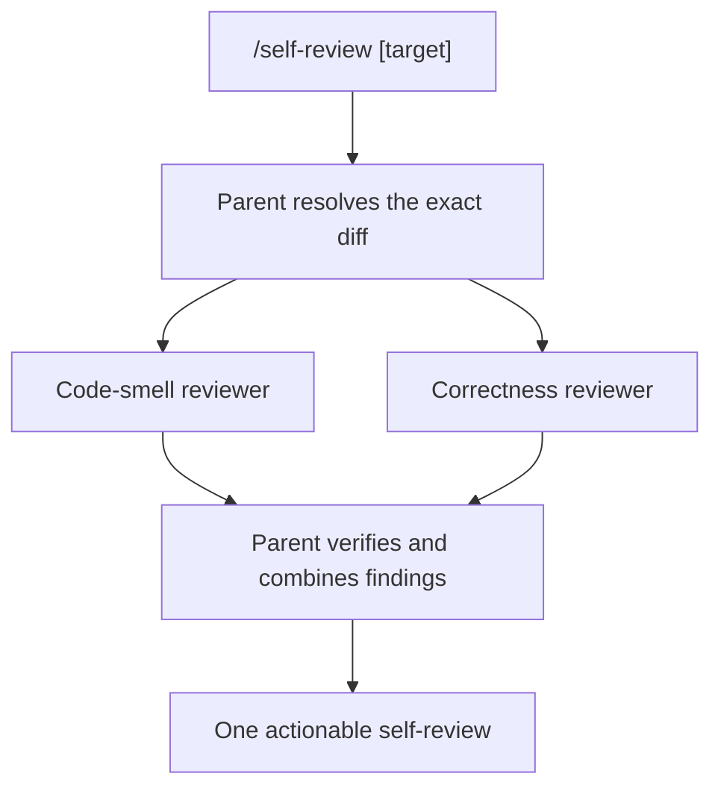

# Todo

## Improve review flows

- [x] Build the two custom review subagents.
- [x] Add `/self-review` and test it against a seeded diff.
- [x] Disable the built-in `reviewer`.
- [x] Remove the old `/review` prompt.
- [ ] Revisit `/ts-review` after using the base self-review flow on real changes.

## Self-review implementation

`/self-review [target]` keeps the parent agent in charge. An explicit target wins. Without one, the parent reviews worktree changes when present, the whole open pull request when the worktree is clean, or the current branch against `main` or `master` when no pull request exists. It then launches two fresh-context reviewers in parallel, verifies their claims, and returns one review. The command is review-only.

### Files

- `pi/.pi/agent/agents/code-smell-reviewer.md` owns the fixed 12-smell catalog and reports no other kind of concern.
- `pi/.pi/agent/agents/correctness-reviewer.md` owns changed-behavior defects, security, compatibility, error handling, and concrete test gaps.
- `pi/.pi/agent/prompts/self-review.md` resolves the scope and runs both agents through one fresh-context parallel workflow.
- `pi/.pi/agent/settings.json` disables the bundled `reviewer`.
- `pi/.pi/agent/prompts/review.md` has been removed.

Both custom agents use `openai-codex/gpt-5.6-terra` with high thinking. Their direct tool lists omit `edit` and `write`.

### Validation

The seeded repository contained:

- duplicated filtering and sorting introduced in two changed functions;
- an off-by-one array boundary regression;
- an unchanged pre-existing mysterious name beside an unrelated change;
- an untracked source file with an always-true length check.

The two agents launched in one asynchronous workflow with fresh context. The smell reviewer reported only `Duplicated Code` and ignored the pre-existing name. The correctness reviewer found the boundary regression and the untracked-file defect, plus two real baseline behavior changes in the fixture. Both cited paths and lines. The workflow left the fixture unchanged.

`subagent({ action: "list" })` now shows both custom reviewers as executable and omits the disabled bundled reviewer. Both the durable dotfiles setting and this machine's local Pi setting contain the disable override.

## `/ts-review` follow-up

Keep the current Trusted Server PR workflow unchanged until the base flow has seen regular use. Then decide whether `/ts-review` should run the same two reviewers against a locked PR revision or stay a separate deep PR audit. Preserve its exact-revision, CI, existing-feedback, and Trusted Server-specific checks either way.
